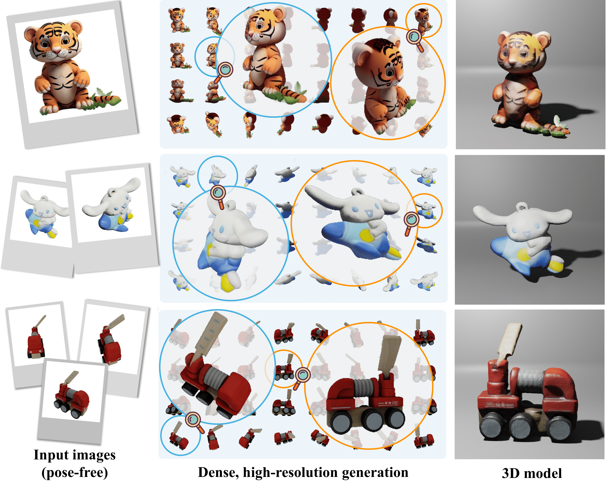

# MVDiffusion++: A Dense High-resolution Multi-view Diffusion Model for Single or Sparse-view 3D Object Reconstruction

<div align="center">
  
</div>

# [Project page](https://mvdiffusion-plusplus.github.io/) |  [Paper]() 

### We may not release codes here. This repo is mainly for discussions. 

## Citation

If you use our work in your research, please cite it as follows:

```bibtex
@article{tang2024mvdiffusionpp,
  title={MVDiffusion++: A Dense High-resolution Multi-view Diffusion Model for Single to Sparse-view 3D ObjectReconstruction},
  author={Tang, Shitao and Chen, Jiacheng and Wang, Dilin and Tang, Chengzhou and Zhang, Fuyang and Fan, Yuchen and Chandra, Vikas and Furukawa, Yasutaka and Ranjan, Rakesh},
  journal={arXiv preprint arXiv:2402.12712},
  year={2024}
}
```
